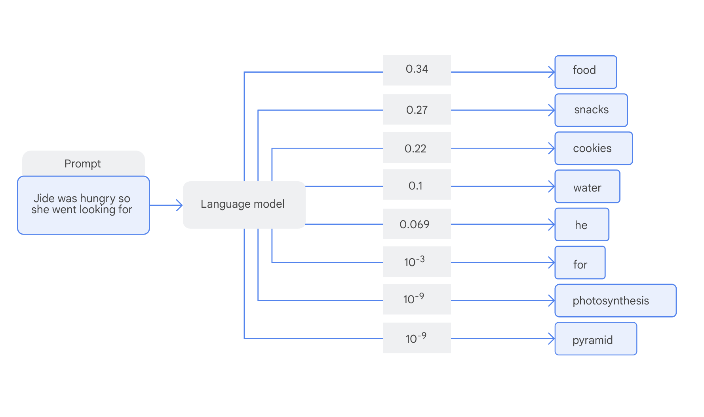

# The Power of Language Models

- Language is one of the most powerful and diverse tools that humans possess.

- Most languages share common patterns such as syntax (the way words are put together), semantics (the meanings of words and their combinations), and contextual dependencies. These common patterns make them understandable and more importantly, learnable. It is this universal learnability that makes building language models possible.

---

## The rise of Language Models

- A language model (LM) is a system that predicts the next word in a sequence based on previous words
- This is done by assigning probabilities to all possible next words and then choosing the next word based on these probabilities. The probabilities themselves are generally learned by the model from large amounts of data using machine learning methods, such as deep learning.

---

## Why language modeling matters
- The principles of language models extend far beyond human language. If you replace words with other sequential data types, you can apply the same deep learning techniques to a variety of scientific and business challenges:

### Music Generation
- Many music traditions, from Brazilian samba to South African amapiano, follow structured patterns. AI models can generate rhythms, harmonies, and lyrics across a range of genres 

### Protein science and drug discovery
- Proteins are made up of sequences of amino acids, much like sentences. Models can be trained to predict protein functions and protein structure from these amino acid sequences. The resulting model allows us then to predict potential functions of newly discovered proteins, design new potential proteins, and may assist in drug discovery. For example, models like ProtNLM learn to predict text describing the functional properties of a given protein, defined by its sequence of amino acids

### Climate modeling and weather prediction
- Meteorological data is a sequence of temperature, pressure, and atmospheric conditions. While traditional models rely on physics-based simulations, deep learning models have been used to enhance short-term weather prediction and climate modeling

- Language models are enormously powerful and can bring immense value to society in solving the kinds of problems you have just considered. However, with that power comes the responsibility to ensure that they are aligned with the varying needs of our society.

- Without addressing the real needs of real people, there is a potential risk that the benefits of language models might be unequally distributed.

